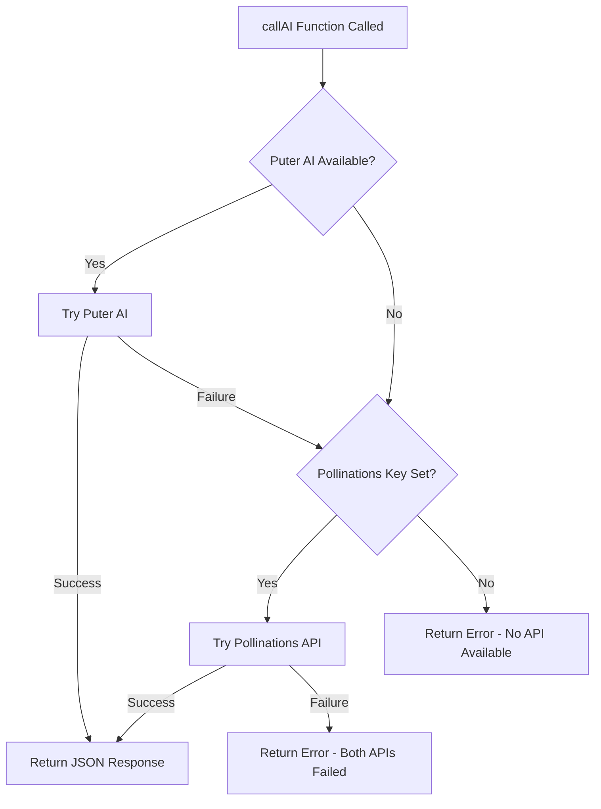

# Migration Plan: Gemini to Puter AI with Pollinations Fallback

## Executive Summary

This document outlines the migration strategy for replacing the Gemini API with Puter AI as the primary AI provider and Pollinations as a fallback for the "Name Explorer" application.

---

## 1. Current Implementation Analysis

### 1.1 Core Helper Function

The current implementation uses [`callGemini(prompt, schema)`](index.html:87) which:
- Validates API key presence
- Makes POST requests to Gemini API
- Uses JSON Schema structured output via `responseMimeType: "application/json"` and `responseSchema`
- Returns JSON string response

### 1.2 API Call Sites (7 total)

| Function | Location | Purpose |
|----------|----------|---------|
| [`fetchTopNames`](index.html:777) | Line 796 | Fetches top baby names by location/year |
| [`generateNameMeanings`](index.html:934) | Line 961 | Generates name meaning interpretations |
| [`generateNameStatistics`](index.html:983) | Line 1013 | Generates name popularity statistics |
| [`generateBirthFacts`](index.html:1036) | Line 1063 | Generates birth date-related facts |
| [`generateMusicData`](index.html:1085) | Line 1182 | Generates music/entertainment data |
| [`generateFacts`](index.html:1205) | Line 1236 | Generates historical facts |
| [`generateLifetimeEvents`](index.html:1258) | Line 1288 | Generates lifetime events timeline |

### 1.3 Current Configuration

- **Model**: `gemini-2.0-flash`
- **API Key Storage**: `localStorage.getItem("GEMINI_API_KEY")`
- **Settings UI**: Password input field in Settings modal (lines 2065-2084)

---

## 2. Target Architecture

### 2.1 New API Call Flow



### 2.2 New Unified Helper Function

```javascript
// New unified AI calling function with fallback
async function callAI(prompt, schema) {
  // Try Puter AI first (no API key required)
  try {
    return await callPuterAI(prompt, schema);
  } catch (puterError) {
    console.warn('Puter AI failed, trying Pollinations fallback:', puterError);
    
    // Fallback to Pollinations if API key is configured
    if (window.POLLINATIONS_API_KEY) {
      try {
        return await callPollinations(prompt, schema);
      } catch (pollinationsError) {
        console.error('Pollinations also failed:', pollinationsError);
        throw new Error('Both AI providers failed. Please check your configuration.');
      }
    }
    
    throw new Error('AI_SERVICE_UNAVAILABLE');
  }
}
```

---

## 3. Implementation Details

### 3.1 Puter AI Integration

#### SDK Script Tag Addition

Add before the main script block in [`index.html`](index.html:61):

```html
<!-- Puter.js SDK for AI capabilities -->
<script src="https://js.puter.com/v2/"></script>
```

#### Puter AI Helper Function

```javascript
async function callPuterAI(prompt, schema) {
  // Build system prompt with JSON schema instructions
  const systemPrompt = buildJSONSchemaPrompt(schema);
  
  const messages = [
    { role: 'system', content: systemPrompt },
    { role: 'user', content: prompt }
  ];
  
  const response = await puter.ai.chat(messages, {
    model: 'gpt-4o-mini',  // Recommended model (see section 5.1)
    temperature: 0.7
  });
  
  // Extract and validate JSON from response
  const responseText = response.message?.content || response.toString();
  return extractJSON(responseText);
}
```

### 3.2 Pollinations Fallback Integration

#### Pollinations Helper Function

```javascript
const POLLINATIONS_API_URL = 'https://gen.pollinations.ai/v1/chat/completions';

async function callPollinations(prompt, schema) {
  if (!window.POLLINATIONS_API_KEY) {
    throw new Error('POLLINATIONS_API_KEY_NOT_SET');
  }
  
  const systemPrompt = buildJSONSchemaPrompt(schema);
  
  const response = await fetch(POLLINATIONS_API_URL, {
    method: 'POST',
    headers: {
      'Authorization': `Bearer ${window.POLLINATIONS_API_KEY}`,
      'Content-Type': 'application/json'
    },
    body: JSON.stringify({
      model: 'openai',  // Uses OpenAI-compatible mode
      messages: [
        { role: 'system', content: systemPrompt },
        { role: 'user', content: prompt }
      ],
      temperature: 0.7
    })
  });
  
  if (!response.ok) {
    const errorData = await response.json().catch(() => ({}));
    throw new Error(`Pollinations API error: ${response.status} - ${errorData.error?.message || response.statusText}`);
  }
  
  const data = await response.json();
  const responseText = data.choices[0].message.content;
  return extractJSON(responseText);
}
```

### 3.3 JSON Schema Prompt Engineering

Since neither Puter nor Pollinations supports native JSON Schema validation, we need prompt engineering:

```javascript
function buildJSONSchemaPrompt(schema) {
  let schemaDescription = 'You MUST respond with ONLY valid JSON. No markdown, no code blocks, no explanation.\n\n';
  schemaDescription += 'The response must conform to this JSON Schema:\n';
  schemaDescription += '```json\n';
  schemaDescription += JSON.stringify(schema, null, 2);
  schemaDescription += '\n```\n\n';
  schemaDescription += 'Important rules:\n';
  schemaDescription += '1. Return ONLY the JSON object, nothing else\n';
  schemaDescription += '2. Do not wrap in markdown code blocks\n';
  schemaDescription += '3. Ensure all required fields are present\n';
  schemaDescription += '4. Use proper JSON syntax (double quotes, commas)\n';
  
  return schemaDescription;
}

function extractJSON(text) {
  // Remove potential markdown code blocks
  let cleaned = text.trim();
  
  // Remove ```json ... ``` wrappers
  if (cleaned.startsWith('```json')) {
    cleaned = cleaned.replace(/^```json\s*/, '').replace(/\s*```$/, '');
  } else if (cleaned.startsWith('```')) {
    cleaned = cleaned.replace(/^```\s*/, '').replace(/\s*```$/, '');
  }
  
  // Parse to validate JSON
  try {
    JSON.parse(cleaned);
    return cleaned;
  } catch (e) {
    // Try to extract JSON object from text
    const jsonMatch = cleaned.match(/\{[\s\S]*\}/);
    if (jsonMatch) {
      JSON.parse(jsonMatch[0]); // Validate
      return jsonMatch[0];
    }
    throw new Error('Failed to extract valid JSON from AI response');
  }
}
```

---

## 4. Code Changes Required

### 4.1 Changes to index.html

| Section | Line Range | Change Description |
|---------|------------|-------------------|
| Script tags | ~8 | Add Puter SDK script tag |
| Global config | 61-65 | Replace Gemini config with new AI config |
| Helper function | 87-112 | Replace `callGemini` with `callAI` + helpers |
| Settings default | 614 | Replace `geminiApiKey` with `pollinationsApiKey` |
| Settings UI | 2065-2084 | Update API key input for Pollinations |
| Error messages | Various | Update error messages for new providers |

### 4.2 Detailed Change List

#### 1. Add Puter SDK Script (after line 11)

```html
<!-- Puter.js SDK - Primary AI provider (no API key required) -->
<script src="https://js.puter.com/v2/"></script>
```

#### 2. Replace Global Configuration (lines 61-65)

**Before:**
```javascript
<script>
  // Gemini API Configuration
  window.GEMINI_API_KEY = localStorage.getItem("GEMINI_API_KEY") || "";
  window.GEMINI_API_URL = "https://generativelanguage.googleapis.com/v1beta/models/gemini-2.0-flash:generateContent";
</script>
```

**After:**
```javascript
<script>
  // AI Configuration - Pollinations fallback (optional)
  // Puter AI requires no API key and is used as primary provider
  window.POLLINATIONS_API_KEY = localStorage.getItem("POLLINATIONS_API_KEY") || "";
</script>
```

#### 3. Replace Helper Function (lines 87-112)

Replace the entire `callGemini` function with the new `callAI`, `callPuterAI`, `callPollinations`, `buildJSONSchemaPrompt`, and `extractJSON` functions.

#### 4. Update Default Settings (line 614)

**Before:**
```javascript
geminiApiKey: localStorage.getItem("GEMINI_API_KEY") || ""
```

**After:**
```javascript
pollinationsApiKey: localStorage.getItem("POLLINATIONS_API_KEY") || ""
```

#### 5. Update Settings Save Logic (lines 1524-1531)

**Before:**
```javascript
// Save Gemini API key to localStorage and update window variable
if (tempSettings.geminiApiKey) {
  localStorage.setItem("GEMINI_API_KEY", tempSettings.geminiApiKey);
  window.GEMINI_API_KEY = tempSettings.geminiApiKey;
} else {
  localStorage.removeItem("GEMINI_API_KEY");
  window.GEMINI_API_KEY = "";
}
```

**After:**
```javascript
// Save Pollinations API key to localStorage (optional fallback)
if (tempSettings.pollinationsApiKey) {
  localStorage.setItem("POLLINATIONS_API_KEY", tempSettings.pollinationsApiKey);
  window.POLLINATIONS_API_KEY = tempSettings.pollinationsApiKey;
} else {
  localStorage.removeItem("POLLINATIONS_API_KEY");
  window.POLLINATIONS_API_KEY = "";
}
```

#### 6. Update Settings UI (lines 2065-2084)

**Before:**
```jsx
<p className="text-sm text-gray-600 dark:text-gray-400 mb-3">
  Enter your free Gemini API key to enable AI-powered name statistics.
  <a href="https://aistudio.google.com/apikey" target="_blank" rel="noopener noreferrer" className="text-blue-500 hover:text-blue-700 ml-1">
    Get a free API key <FaExternalLinkAlt className="text-xs" />
  </a>
</p>
<input
  type="password"
  value={tempSettings.geminiApiKey || ""}
  onChange={(e) => setTempSettings({...tempSettings, geminiApiKey: e.target.value})}
  placeholder="Enter your Gemini API key"
  ...
/>
```

**After:**
```jsx
<p className="text-sm text-gray-600 dark:text-gray-400 mb-3">
  <strong>Primary:</strong> Puter AI is used by default (no API key required!).
</p>
<p className="text-sm text-gray-600 dark:text-gray-400 mb-3">
  <strong>Fallback:</strong> Optionally add a Pollinations API key for redundancy.
  <a href="https://enter.pollinations.ai" target="_blank" rel="noopener noreferrer" className="text-blue-500 hover:text-blue-700 ml-1">
    Get a free API key <FaExternalLinkAlt className="text-xs" />
  </a>
</p>
<input
  type="password"
  value={tempSettings.pollinationsApiKey || ""}
  onChange={(e) => setTempSettings({...tempSettings, pollinationsApiKey: e.target.value})}
  placeholder="Pollinations API key (optional)"
  ...
/>
```

#### 7. Update Error Messages (7 locations)

Replace all instances of `GEMINI_API_KEY_NOT_SET` error handling:

**Before:**
```javascript
if (errorMessage === "GEMINI_API_KEY_NOT_SET") {
  errorMessage = "Please configure your Gemini API key in Settings to use this feature.";
}
```

**After:**
```javascript
if (errorMessage === "AI_SERVICE_UNAVAILABLE") {
  errorMessage = "AI service is temporarily unavailable. Please try again later or configure a Pollinations API key in Settings for fallback.";
}
```

---

## 5. Model Selection Recommendations

### 5.1 Puter AI Model

**Selected: `gpt-5-nano` (Puter default)**

| Model | Pros | Cons |
|-------|------|------|
| `gpt-5-nano` (Selected) | Fastest, cheapest, Puter default | May struggle with very complex schemas |
| `gpt-4o-mini` | Good JSON compliance, free tier | Slightly slower than nano |
| `claude-sonnet-4` | Excellent instruction following | May be slower/overkill |
| `gemini-2.5-flash-lite` | Good balance | Less JSON reliability |

**Rationale**: `gpt-5-nano` is the Puter default, offering the fastest response times and lowest cost. Since we have Pollinations as a fallback, any edge cases where nano struggles can be handled by the fallback mechanism.

### 5.2 Pollinations Fallback Model

**Recommended: `openai`** (OpenAI-compatible mode)

This uses Pollinations' OpenAI-compatible endpoint which provides reliable JSON output.

---

## 6. UI/UX Considerations

### 6.1 Loading States

Current implementation already has `loadingSection` state - no changes needed.

### 6.2 Error Messages

Update error messages to reflect new architecture:

| Error Type | User Message |
|------------|--------------|
| Puter fails, Pollinations succeeds | Silent fallback (log warning) |
| Both APIs fail | "AI services are temporarily unavailable. Please try again later." |
| Rate limited | "Too many requests. Please wait a moment and try again." |

### 6.3 Settings Panel Updates

- Remove mandatory API key requirement
- Add explanation that Puter AI works without configuration
- Make Pollinations key clearly optional
- Add "Powered by Puter" link as per Puter's requirements

### 6.4 Footer Attribution

Add Puter attribution to comply with their terms:

```jsx
<a href="https://developer.puter.com" target="_blank" rel="noopener noreferrer" 
   className="text-gray-500 hover:text-gray-700 text-xs">
  Powered by Puter
</a>
```

---

## 7. Testing Strategy

### 7.1 Test Cases

1. **Primary Path**: Verify Puter AI works without any API key
2. **Fallback Path**: Simulate Puter failure, verify Pollinations fallback
3. **Error Handling**: Verify graceful error messages when both fail
4. **JSON Parsing**: Test with complex schemas to ensure reliable JSON output
5. **Rate Limiting**: Verify behavior under rate limits

### 7.2 Regression Testing

Ensure all 7 API call sites still function:
- [ ] fetchTopNames
- [ ] generateNameMeanings
- [ ] generateNameStatistics
- [ ] generateBirthFacts
- [ ] generateMusicData
- [ ] generateFacts
- [ ] generateLifetimeEvents

---

## 8. Migration Checklist for Code Mode

### Phase 1: Infrastructure
- [ ] Add Puter SDK script tag
- [ ] Replace global configuration variables
- [ ] Implement new helper functions (callAI, callPuterAI, callPollinations, buildJSONSchemaPrompt, extractJSON)

### Phase 2: Integration
- [ ] Update all 7 API call sites to use `callAI` instead of `callGemini`
- [ ] Update default settings object
- [ ] Update settings save/load logic

### Phase 3: UI Updates
- [ ] Update Settings modal API key section
- [ ] Update all error message handlers (7 locations)
- [ ] Add Puter attribution to footer

### Phase 4: Cleanup
- [ ] Remove old Gemini-specific code
- [ ] Update comments and documentation
- [ ] Test all functionality

---

## 9. Rollback Plan

If issues arise, rollback is straightforward:

1. Revert to previous `index.html` version
2. No database changes were made
3. User data (profiles) remains compatible

---

## 10. Summary of Benefits

| Aspect | Before (Gemini) | After (Puter + Pollinations) |
|--------|-----------------|------------------------------|
| API Key | Required | Optional (only for fallback) |
| User Friction | High (must get API key) | Low (works out of box) |
| Reliability | Single point of failure | Dual provider fallback |
| Cost | Free tier limited | Puter free + Pollinations free tier |
| JSON Support | Native JSON Schema | Prompt engineering required |

---

## Appendix A: Complete New Helper Functions Code

```javascript
// ============================================================
// AI Helper Functions - Puter AI (primary) + Pollinations (fallback)
// ============================================================

const POLLINATIONS_API_URL = 'https://gen.pollinations.ai/v1/chat/completions';

// Main entry point - tries Puter first, then Pollinations fallback
async function callAI(prompt, schema) {
  // Try Puter AI first (no API key required)
  try {
    return await callPuterAI(prompt, schema);
  } catch (puterError) {
    console.warn('Puter AI failed, trying Pollinations fallback:', puterError);
    
    // Fallback to Pollinations if API key is configured
    if (window.POLLINATIONS_API_KEY) {
      try {
        return await callPollinations(prompt, schema);
      } catch (pollinationsError) {
        console.error('Pollinations also failed:', pollinationsError);
        throw new Error('AI_SERVICE_UNAVAILABLE');
      }
    }
    
    // If Pollinations key not set, throw Puter error
    throw puterError;
  }
}

// Puter AI implementation
async function callPuterAI(prompt, schema) {
  const systemPrompt = buildJSONSchemaPrompt(schema);
  
  const messages = [
    { role: 'system', content: systemPrompt },
    { role: 'user', content: prompt }
  ];
  
  try {
    const response = await puter.ai.chat(messages, {
      model: 'gpt-5-nano',  // Puter default - fastest and cheapest
      temperature: 0.7
    });
    
    // Handle different response formats
    let responseText;
    if (response.message?.content) {
      responseText = response.message.content;
    } else if (typeof response === 'string') {
      responseText = response;
    } else if (response.toString) {
      responseText = response.toString();
    } else {
      throw new Error('Unexpected response format from Puter AI');
    }
    
    return extractJSON(responseText);
  } catch (error) {
    throw new Error(`Puter AI error: ${error.message}`);
  }
}

// Pollinations fallback implementation
async function callPollinations(prompt, schema) {
  if (!window.POLLINATIONS_API_KEY) {
    throw new Error('POLLINATIONS_API_KEY_NOT_SET');
  }
  
  const systemPrompt = buildJSONSchemaPrompt(schema);
  
  const response = await fetch(POLLINATIONS_API_URL, {
    method: 'POST',
    headers: {
      'Authorization': `Bearer ${window.POLLINATIONS_API_KEY}`,
      'Content-Type': 'application/json'
    },
    body: JSON.stringify({
      model: 'openai',
      messages: [
        { role: 'system', content: systemPrompt },
        { role: 'user', content: prompt }
      ],
      temperature: 0.7
    })
  });
  
  if (!response.ok) {
    const errorData = await response.json().catch(() => ({}));
    throw new Error(`Pollinations API error: ${response.status} - ${errorData.error?.message || response.statusText}`);
  }
  
  const data = await response.json();
  const responseText = data.choices[0].message.content;
  return extractJSON(responseText);
}

// Build system prompt with JSON schema instructions
function buildJSONSchemaPrompt(schema) {
  return `You MUST respond with ONLY valid JSON. No markdown, no code blocks, no explanation - just the raw JSON object.

The response must conform to this JSON Schema:
${JSON.stringify(schema, null, 2)}

Critical rules:
1. Return ONLY the JSON object, nothing else
2. Do NOT wrap in markdown code blocks (no \`\`\`json)
3. Ensure ALL required fields are present
4. Use proper JSON syntax (double quotes, commas between items)
5. No trailing commas
6. Start with { and end with }`;
}

// Extract and validate JSON from AI response
function extractJSON(text) {
  let cleaned = text.trim();
  
  // Remove ```json ... ``` or ``` ... ``` wrappers
  cleaned = cleaned.replace(/^```(?:json)?\s*/i, '').replace(/\s*```$/,'');
  
  // Parse to validate JSON
  try {
    JSON.parse(cleaned);
    return cleaned;
  } catch (e) {
    // Try to extract JSON object from mixed content
    const jsonMatch = cleaned.match(/\{[\s\S]*\}/);
    if (jsonMatch) {
      try {
        JSON.parse(jsonMatch[0]); // Validate
        return jsonMatch[0];
      } catch (e2) {
        // Continue to error
      }
    }
    console.error('Failed to parse JSON from response:', cleaned);
    throw new Error('Failed to extract valid JSON from AI response');
  }
}
```

---

## Appendix B: Settings UI Component Update

```jsx
{/* AI Configuration Section */}
<div className="mb-6">
  <h3 className="text-lg font-semibold mb-3 dark:text-white">AI Configuration</h3>
  
  <div className="bg-green-50 dark:bg-green-900/20 border border-green-200 dark:border-green-800 rounded-lg p-3 mb-4">
    <p className="text-sm text-green-700 dark:text-green-300">
      <strong>✓ Primary AI:</strong> Puter AI is enabled by default (no configuration needed!)
    </p>
  </div>
  
  <p className="text-sm text-gray-600 dark:text-gray-400 mb-3">
    <strong>Optional Fallback:</strong> Add a Pollinations API key for redundancy when Puter is unavailable.
    <a
      href="https://enter.pollinations.ai"
      target="_blank"
      rel="noopener noreferrer"
      className="text-blue-500 hover:text-blue-700 ml-1 inline-flex items-center gap-1"
    >
      Get a free API key <FaExternalLinkAlt className="text-xs" />
    </a>
  </p>
  
  <input
    type="password"
    value={tempSettings.pollinationsApiKey || ""}
    onChange={(e) => setTempSettings({
      ...tempSettings,
      pollinationsApiKey: e.target.value
    })}
    placeholder="Pollinations API key (optional)"
    className="w-full px-4 py-2 rounded-lg border-2 border-gray-300 focus:border-blue-500 focus:ring-4 focus:ring-blue-200 dark:bg-gray-600 dark:border-gray-500 dark:text-white"
  />
</div>
```

---

*Document Version: 1.0*
*Created: 2026-02-10*
*Status: Ready for Review*
